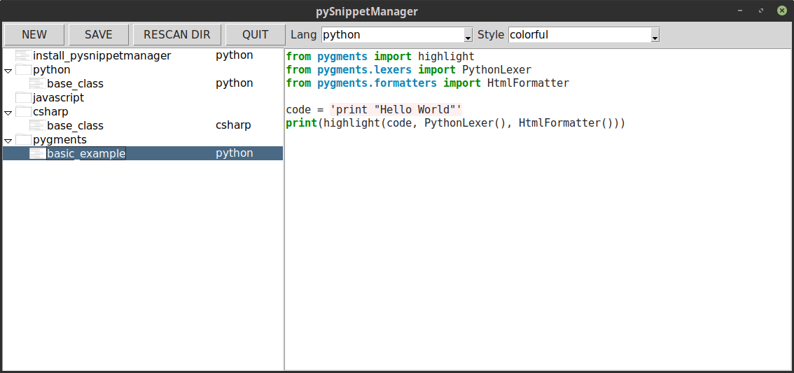

A Python Snippet Manager
========================

Dependencies
------------

 - pygments
 - pillow

What is Working
---------------

 - bare minimum

What is not Working/Missing
---------------------------

 - Documentation
 - tags
 - add Directories
 

Installation
------------

::

    pip3 install pysnippetmanager

Usage
-----

::

    pysnippetmanager

Contribute
----------

 - Issue Tracker: https://github.com/trombastic/pySnippetManager/issues
 - Source Code: https://github.com/trombastic/pySnippetManager

License
-------

The project is licensed under the _GNU General Public License v3 (GPLv3)_.
